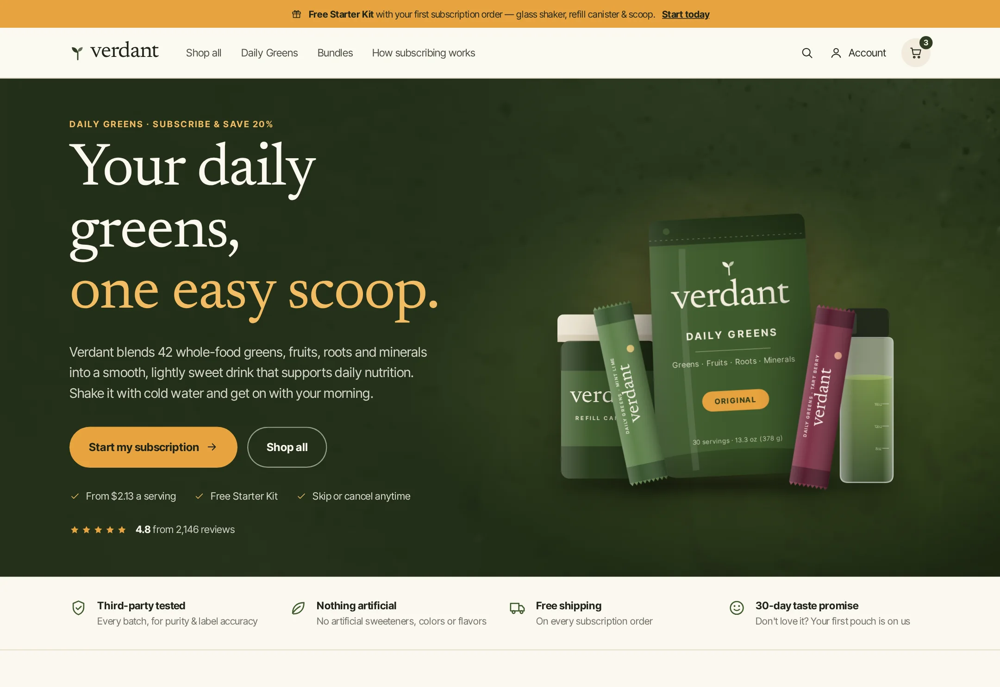

# Verdant

Subscription-first storefront for a daily greens powder brand.

**Live demo:** https://www.freelancerportfoliohub.com/jameslee/projects/verdant/index.html



## Overview

Verdant sells daily greens and companion blends mainly through subscriptions. The storefront makes Subscribe &
Save the easy default at every step: product pages open with the subscription pre-selected and show the
per-serving price, the free Starter Kit and a delivery-frequency picker, with the one-time option underneath.
The cart labels every line as a subscription or one-time purchase, shows a free-shipping bar and a matching
upsell, and spells out the renewal (date, price, skip anytime) before checkout.

Product packaging — pouches, travel sticks, the refill canister, shaker, scoop and gift card — is drawn as
inline SVG from catalog data in each flavor's palette, so a new flavor, format or bundle is a data change, not
a photo shoot.

## Features

- **Subscription selector** – Subscribe & Save first and pre-selected, 30/45/60-day frequency, live savings,
  per-serving pricing and one-time fallback; all maths in `lib/subscriptions.ts` (unit tested).
- **Product pages** – flavor picker synced to `?flavor=`, swipeable gallery on mobile, sticky mobile
  add-to-cart bar, ingredient panel, pouch-vs-sticks comparison, review summary and cross-sells.
- **Shop** – `/collections/[handle]` with category chips, sort, a Starter Kit promo tile and bundle cards with
  computed savings.
- **Cart** – cookie-backed cart via `/api/cart`: quantity steppers, switch a line to Subscribe & Save or change
  its frequency in place, automatic free Starter Kit on subscription orders, free-shipping progress, promo codes,
  a same-box upsell and a renewal notice.
- **Code-drawn product art** – `components/art/` renders every SKU from an `ArtSpec` in `lib/data/products.ts`.
- **Accessible** – real form controls, native `<details>` disclosures, visible focus states and a skip link.

## Tech stack

- [Next.js 15](https://nextjs.org/) App Router, React 19 Server Components
- TypeScript (strict)
- zod for API validation
- Vitest for subscription and cart-total logic
- Hand-written CSS with design tokens (`app/globals.css`); Inter Tight and Newsreader self-hosted via `next/font/local`

## Getting started

```bash
pnpm install
cp .env.example .env.local
pnpm dev
```

Open http://localhost:3000.

### Environment variables

| Variable                   | Required | Description                                            |
| -------------------------- | -------- | ------------------------------------------------------ |
| `NEXT_PUBLIC_SITE_URL`     | No       | Canonical storefront URL for metadata and the sitemap. |
| `NEXT_PUBLIC_CHECKOUT_URL` | No       | Hosted checkout the cart hands off to (`?cart=<id>`).  |
| `NEXT_PUBLIC_ACCOUNT_URL`  | No       | Customer portal for skipping, swapping and pausing.    |
| `NEWSLETTER_WEBHOOK_URL`   | No       | Receives "first dibs" sign-ups. Logged when unset.     |

## Subscription rules

| Rule             | Value                                                   |
| ---------------- | ------------------------------------------------------- |
| Subscribe & Save | 20% off the one-time price, rounded to the cent         |
| Frequencies      | Every 30 (recommended), 45 or 60 days                   |
| Starter Kit      | Free ($42 value) on any order containing a subscription |
| Shipping         | Free on subscriptions; one-time orders free over $75    |
| Bundles          | Subscription-only, priced per bundle (up to 34% off)    |

## Project structure

```
app/
  api/cart/             cart route handler (GET/POST/PATCH/DELETE)
  api/newsletter/       flavor-launch sign-ups
  cart/                 cart page
  collections/[handle]/ shop pages and bundles
  products/[handle]/    product pages
  policies/[slug]/      subscription terms, privacy, terms, accessibility
  search/               product search
  fonts/                self-hosted woff2 files
components/
  art/                  SVG packaging: pouch, stick, canister, shaker, scoop, gift card
  cart/                 CartProvider, line items, upsell, order summary
  home/                 hero scene, routine cards, ingredients, how subscribing works
  layout/               announcement bar, header, footer
  product/              product view, subscription selector, flavor picker, sticky ATC
  shop/                 chips, sort, bundles, promo tile
  ui/                   icons, prices, stars, disclosures
lib/
  commerce/             Storefront interface, mock implementation, catalog helpers
  data/                 products, bundles, flavors, collections, site & page copy
  subscriptions.ts      Subscribe & Save, frequency, savings and cart totals (+ tests)
public/images/          ingredient and lifestyle photography
```

## Scripts

| Script           | Description                      |
| ---------------- | -------------------------------- |
| `pnpm dev`       | Start the dev server (Turbopack) |
| `pnpm build`     | Production build                 |
| `pnpm start`     | Serve the production build       |
| `pnpm lint`      | ESLint (`next/core-web-vitals`)  |
| `pnpm typecheck` | `tsc --noEmit`                   |
| `pnpm test`      | Run the Vitest suite             |
| `pnpm format`    | Format with Prettier             |
